# Jose Rizal App - Admin Panel User Guide
## Table of Contents
- [Introduction](#introduction)
- [Getting Started](#getting-started)
    - [Logging In](#logging-in)
    - [Dashboard Overview](#dashboard-overview)
- [Managing Cities](#managing-cities)
    - [Adding a City](#adding-a-city)
    - [Viewing and Managing Cities](#viewing-and-managing-cities)
    - [Editing a City](#editing-a-city)
    - [Deleting a City](#deleting-a-city)
- [Managing Locations](#managing-locations)
    - [Adding a Location](#adding-a-location)
    - [Viewing and Managing Locations](#viewing-and-managing-locations)
    - [Editing a Location](#editing-a-location)
    - [Deleting a Location](#deleting-a-location)
- [Managing Articles](#managing-articles)
    - [Adding an Article](#adding-an-article)
    - [Viewing and Managing Articles](#viewing-and-managing-articles)
    - [Editing an Article](#editing-an-article)
    - [Deleting an Article](#deleting-an-article)
- [Common Issues and Troubleshooting](#common-issues-and-troubleshooting)
    - [Logging In Issues](#logging-in-issues)
    - [Content Management Issues](#content-management-issues)
    - [Form Submission Issues](#form-submission-issues)
    - [Image Upload Issues](#image-upload-issues)

## Introduction
The Jose Rizal App Admin Panel is a comprehensive management tool that allows administrators to control the content of the application. Through this panel, you can manage cities, locations within those cities, and articles independently, as well as associated media. This guide will walk you through the various features and functions of the admin panel, providing step-by-step instructions for each task.

This documentation is intended for administrators who will be managing the content of the Jose Rizal App. It covers the following topics:
- Logging in to the admin panel
- Overview of the dashboard
- Managing cities
- Managing locations
- Managing articles

The admin panel is designed to be user-friendly and intuitive, allowing you to easily navigate through the various sections. Each section includes detailed instructions on how to perform specific tasks, along with screenshots and examples where applicable.

## Getting Started
### Logging In
To access the adminpanel, you must first log in with your credentials. The login page is typically located at `/login`.

1. Navigate to the login page of the application.
2. Enter your username in the "Name" field.
3. Enter your password in the "Password" field.
4. Click the "Login" button.

If your credentials are correct, you will be redirected to the admin dashboard. If you encounter any issues, an error message will be displayed.

**Note**: If you don't have administrator credentials, please contact your system administrator. Only authorized users can access the admin panel.

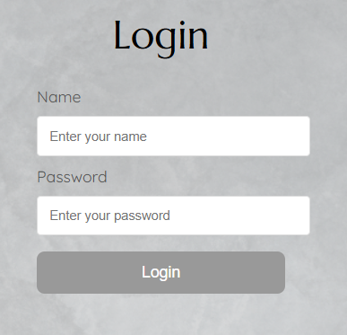

### Admin Panel overview
After logging in, you will be presented with the admin dashboard. The admin panel allows you to manage:

- **Cities**: Add, edit, or delete cities in the application
- **Locations**: Add, edit, or delete locations within cities, including geographical coordinates
- **Articles**: Create, edit, or delete articles with markdown content

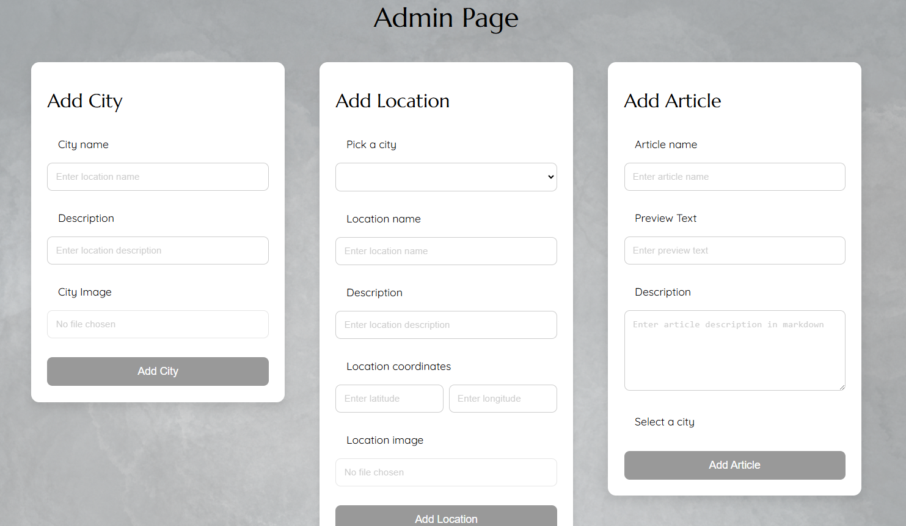

## Managing Cities
Cities are the top-level entities in the application. Each city can contain multiple locations.

### Adding a City
To add a new city:

1. Navigate to the "Add City" section of the admin panel.
2. Enter the city name in the "City name" field.
3. Enter a description of the city in the "Description" field.
4. (Optional) Upload a city image by clicking on the "City Image" field and selecting an image file from your computer.
5. Click the "Add City" button.

If all required fields are filled correctly, a success message will appear, and the city will be added to the database. The page will refresh after a short delay.

**Notes**: 
- City name is a required field.
- Description is optional but recommended for better context.
- The image should be in a supported format (e.g., JPEG, PNG).
- The image should be less than 2MB in size for optimal performance.

If all required fields are filled correctly, a success message will appear, and the location will be added to the database. The page will refresh after a short delay.

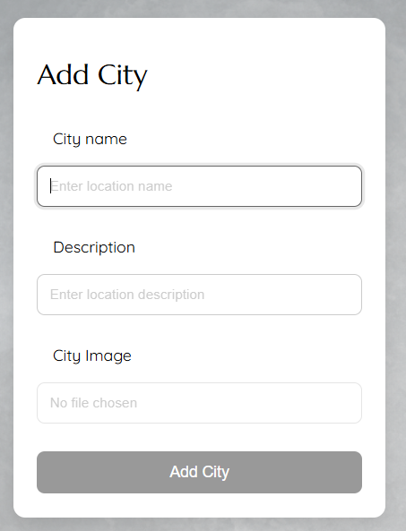

### Viewing and Managing Cities
To view and manage all cities:

1. Navigate to the "Cities" section of the admin panel.
2. A list of all cities will be displayed.
3. Click on a city name to expand and view its details and associated locations.

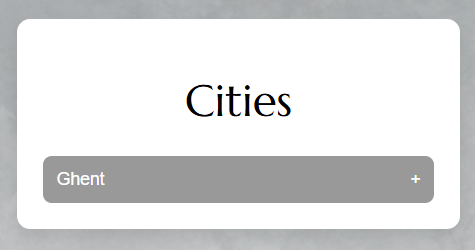

### Editing a City
To edit an existing city:

1. Navigate to the "Cities" section of the admin panel.
2. Find the city you want to edit and click on its name to expand the details.
3. Click the "Edit City" button.
4. Update the city name, description, or image as needed.
5. Click the "Save" button to save your changes.

If your changes are saved successfully, a success message will appear, and the page will refresh after a short delay.

### Deleting a City
**Warning**: Deleting a city will also delete all locations associated with that city. This action cannot be undone.

To delete a city:

1. Navigate to the "Cities" section of the admin panel.
2. Find the city you want to delete and click on its name to expand the details.
3. Click the "Delete City" button.
4. A confirmation dialog will appear. Click "OK" to confirm deletion.

If the city is deleted successfully, the city list will be updated to reflect the changes.

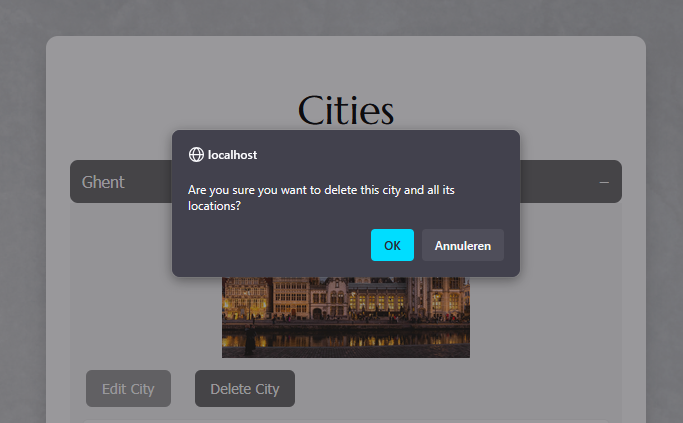

## Managing Locations
Locations are points of interest within a city. Each location has a name, description, geographical coordinates and an image.

### Adding a Location
To add a new location:

1. Navigate to the "Add Location" section of the admin panel.
2. Select a city from the dropdown menu.
3. Enter the location name in the "Location name" field.
4. Enter a description of the location in the "Description" field.
5. Enter the latitude and longitude coordinates in the "Location coordinates" fields.
6. (Optional) Upload a location image by clicking on the "Location image" field and selecting an image file from your computer.
7. Click the "Add Location" button.

**Notes**: 
- City, location name, and coordinates are required fields.
- Latitude must be a number between -90 and 90.
- Longitude must be a number between -180 and 180.
- The image should be in a supported format (e.g., JPEG, PNG).
- The image should be less than 2MB in size for optimal performance.

If all required fields are filled correctly, a success message will appear, and the location will be added to the database. The page will refresh after a short delay.

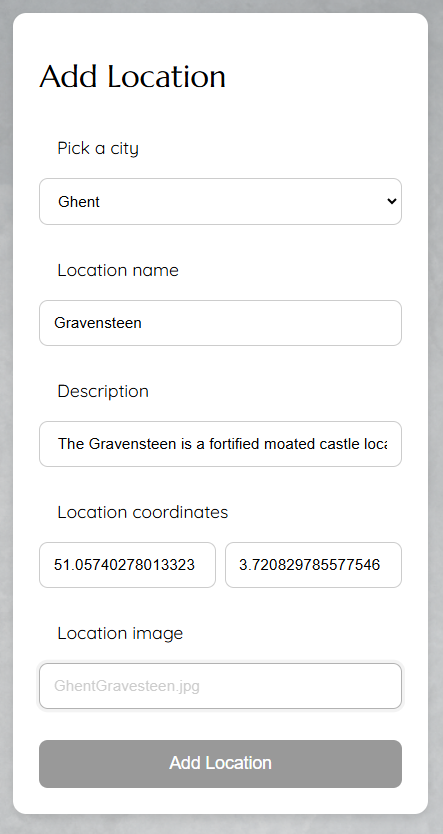

### Viewing and Managing Locations
Locations are displayed within their respective cities:

1. Navigate to the "Cities" section of the admin panel.
2. Click on a city name to expand and view all locations within that city.
3. Each location will display its name, coordinates, and any associated images.

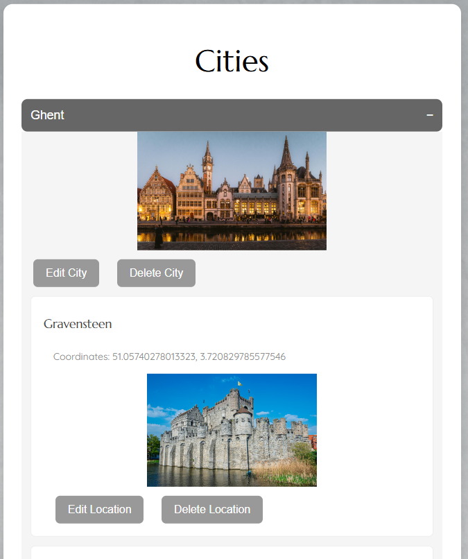

### Editing a Location
To edit an existing location:

1. Navigate to the "Cities" section of the admin panel.
2. Click on the city that contains the location you want to edit.
3. Find the location you want to edit and click the "Edit Location" button.
4. Update the location details as needed.
5. Click the "Save" button to save your changes.

If your changes are saved successfully, a success message will appear, and the page will refresh after a short delay.

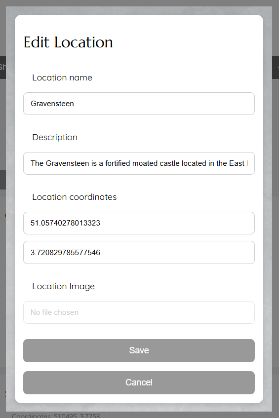

### Deleting a Location

**Warning**: Deleting a location will remove it from the database. This action cannot be undone.

To delete a location:

1. Navigate to the "Cities" section of the admin panel.
2. Click on the city that contains the location you want to delete.
3. Find the location you want to delete and click the "Delete Location" button.
4. A confirmation dialog will appear. Click "OK" to confirm deletion.

If the location is deleted successfully, the location list will be updated to reflect the changes.

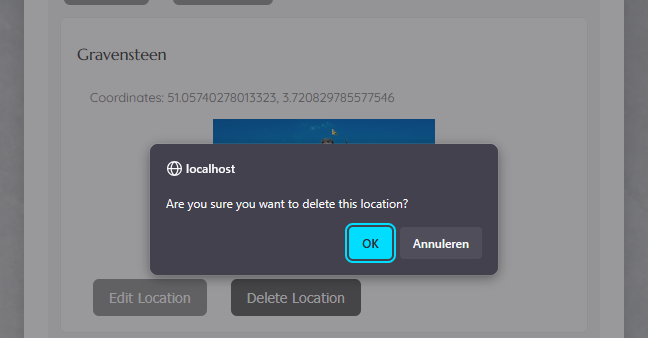

## Managing Articles
Articles are written content that provides information about various topics related to Jose Rizal. They are formatted using Markdown and can be used to provide in-depth information about locations, events, or themes related to Rizal's life and work.

### Adding an Article
To add a new article:

1. Navigate to the "Add Article" section of the admin panel.
2. Enter the article title in the "Article title" field.
3. (Optional) Enter preview text that will be displayed in article listings.
4. Enter the article content in the "Article content" field using Markdown formatting.
7. Click the "Add Article" button.

**Notes**:
- Article title is a required field.
- Preview text is a required field.
- Article content must be formatted using Markdown. Refer to the [Markdown Guide](https://www.markdownguide.org/) for formatting options.

If all required fields are filled correctly, a success message will appear, and the article will be added to the database. The page will refresh after a short delay.

### Viewing and Managing Articles

To view and manage all articles:

1. Navigate to the "Article List" section of the admin panel.
2. A list of all articles will be displayed with their titles and preview text.
3. Click on an article title to expand and view its full content.

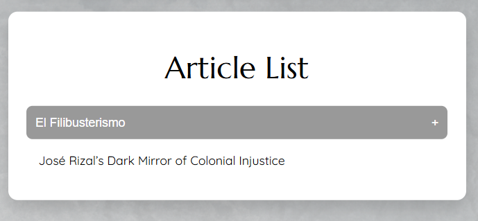

### Editing an Article
To edit an existing article:

1. Navigate to the "Article List" section of the admin panel.
2. Find the article you want to edit and click on its title to expand the details.
3. Click the "Edit Article" button.
4. Update the article details as needed.
5. Click the "Save" button to save your changes.

If your changes are saved successfully, a success message will appear, and the page will refresh after a short delay.

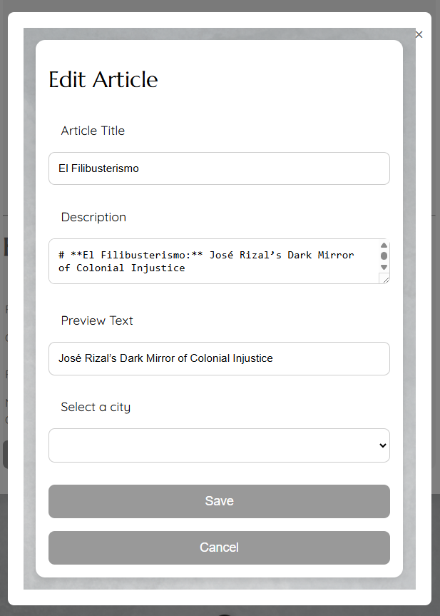

### Deleting an Article
**Warning**: Deleting an article will remove it from the database. This action cannot be undone.

To delete an article:
1. Navigate to the "Article List" section of the admin panel.
2. Find the article you want to delete and click on its title to expand the details.
3. Click the "Delete Article" button.
4. A confirmation dialog will appear. Click "OK" to confirm deletion.

If the article is deleted successfully, the article list will be updated to reflect the changes.

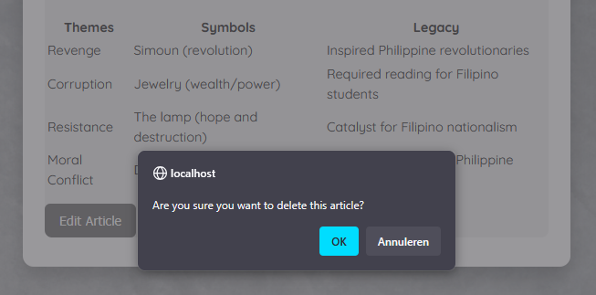
